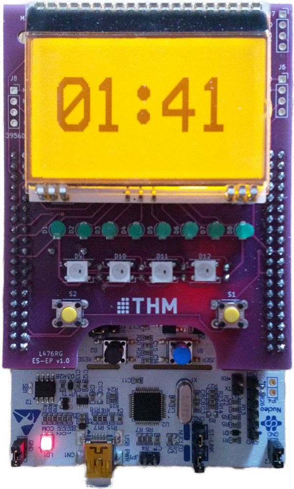

# ES-PCB for Nucleo L476RG
The boad was developed for teaching purposes in the embedded systems laboratory. It is connected to the ST-MORPHO connectors on the Nucleo L476RG. It adds 8 LEDs, two buttons, four WS2812b LEDs and a display to the Nucleo.

This git contains all KiCad files of the project.
